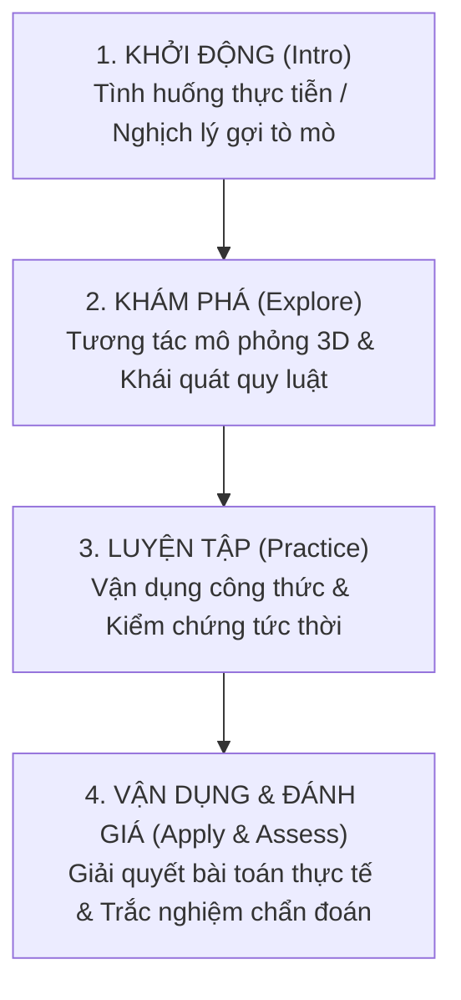

# Math Curriculum GDPT 2018: Khung Sư Phạm Toán THCS

> Dành cho Agent phụ trách phát triển nội dung bài học, kiểm định tính chuẩn mực sư phạm và thiết kế tiến trình dạy học theo Chương trình Giáo dục Phổ thông 2018 môn Toán (Ban hành kèm Thông tư 32/2018/TT-BGDĐT) và Công văn 5512/BGDĐT.

---

## 1. Khung 5 Thành Tố Năng Lực Toán Học Cốt Lõi

Khi thiết kế bài học, hoạt động hoặc câu hỏi, bắt buộc phải gắn mã định danh năng lực và mô tả hành vi biểu hiện:

| Mã Năng Lực | Tên Năng Lực | Biểu Hiện Hành Vi Trong Môi Trường Mô Phỏng 3D |
| :--- | :--- | :--- |
| `MAT_REASONING` | **Tư duy và lập luận toán học** | Giải thích được quan hệ hình học (song song, vuông góc, góc ở tâm/nội tiếp); suy luận từ trường hợp riêng sang quy luật tổng quát. |
| `MAT_MODELING` | **Mô hình hóa toán học** | Chuyển đổi bài toán thực tế (bọc quà, thể tích bể nước, góc nghiêng lều trại) thành mô hình hình học không gian hoặc hàm số $y = ax + b$. |
| `MAT_PROBLEM_SOLVING` | **Giải quyết vấn đề toán học** | Lập kế hoạch điều chỉnh tham số trên mô phỏng để tìm nghiệm, tối ưu hóa kích thước hình khối hoặc chứng minh định lý. |
| `MAT_COMMUNICATION` | **Giao tiếp toán học** | Sử dụng chính xác thuật ngữ, ký hiệu toán học ($S_{xq}, S_{tp}, V, \angle AMB, \overparen{AB}$), đọc hiểu bảng số đo và biểu đồ telemetry. |
| `MAT_TOOLS` | **Sử dụng công cụ & phương tiện học toán** | Thao tác thành thạo trên không gian 3D, điều khiển slider tham số, xoay góc nhìn camera, nhận diện trực quan biến đổi hình học. |

---

## 2. Ma Trận Nội Dung Trọng Tâm THCS (Lớp 6 đến Lớp 9)

### Lớp 6: Số học & Hình học phẳng trực quan
- **Số nguyên trên trục số**: Số âm, số dương, điểm gốc $O$, số đối, giá trị tuyệt đối $|a|$, khoảng cách giữa hai điểm $d(A, B) = |a - b|$.
- **Hình học trực quan**: Hình vuông, tam giác đều, lục giác đều, hình chữ nhật, hình thoi, hình bình hành, hình thang cân.

### Lớp 7: Số thực & Hình học phẳng suy luận
- **Góc và đường thẳng song song**: Góc đối đỉnh, góc kề bù; dấu hiệu nhận biết hai đường thẳng song song qua cát tuyến (cặp góc so le trong, đồng vị, trong cùng phía bù nhau).
- **Tam giác bằng nhau & Định lý Pythagoras**: Các trường hợp bằng nhau c-c-c, c-g-c, g-c-g; quan hệ giữa các yếu tố trong tam giác.

### Lớp 8: Đa thức & Hình học không gian trực quan
- **Hằng đẳng thức đáng nhớ & Phân tích đa thức**: Trực quan hóa hình học cho $(a+b)^2, (a-b)^2, a^2 - b^2$.
- **Hình học không gian**: Hình chóp tam giác đều, hình chóp tứ giác đều, hình lăng trụ đứng tam giác, hình hộp chữ nhật và lập phương ($S_{xq} = C_{\text{đáy}} \cdot h, V = S_{\text{đáy}} \cdot h$).

### Lớp 9: Đại số nâng cao & Hình học đường tròn
- **Hàm số bậc nhất $y = ax + b$**: Ý nghĩa hệ số góc $a$ (đồng biến khi $a > 0$, nghịch biến khi $a < 0$), tung độ gốc $b$, giao điểm với các trục tọa độ.
- **Đường tròn**: Góc ở tâm, góc nội tiếp, góc tạo bởi tiếp tuyến và dây cung; định lý góc nội tiếp $\angle AMB = \frac{1}{2} \text{sđ}\overparen{AB}$; góc nội tiếp chắn nửa đường tròn là góc vuông.

---

## 3. Cấu Trúc Tiến Trình Bài Học Chuẩn (Theo Công Văn 5512)

Mỗi bài học số phải triển khai đầy đủ 4 phân đoạn hoạt động tuần tự:

1. **Khởi động (`intro`)**: Tình huống thực tiễn gần gũi, nêu vấn đề kích thích nhu cầu nhận thức, không định nghĩa bài học quá sớm.
2. **Khám phá (`explore`)**: Gắn liền với mô hình 3D tương tác. Học sinh thực hiện chu trình: *Dự đoán $\rightarrow$ Thao tác $\rightarrow$ Quan sát $\rightarrow$ Rút ra nhận xét*.
3. **Luyện tập (`practice`)**: Hệ thống bài tập có định lượng cụ thể, củng cố trực tiếp công thức và tính chất vừa khám phá.
4. **Vận dụng (`apply`)**: Bài toán gắn với bối cảnh đời sống (kiến trúc, thiết kế bao bì, tính toán đo đạc) rèn luyện năng lực mô hình hóa.
